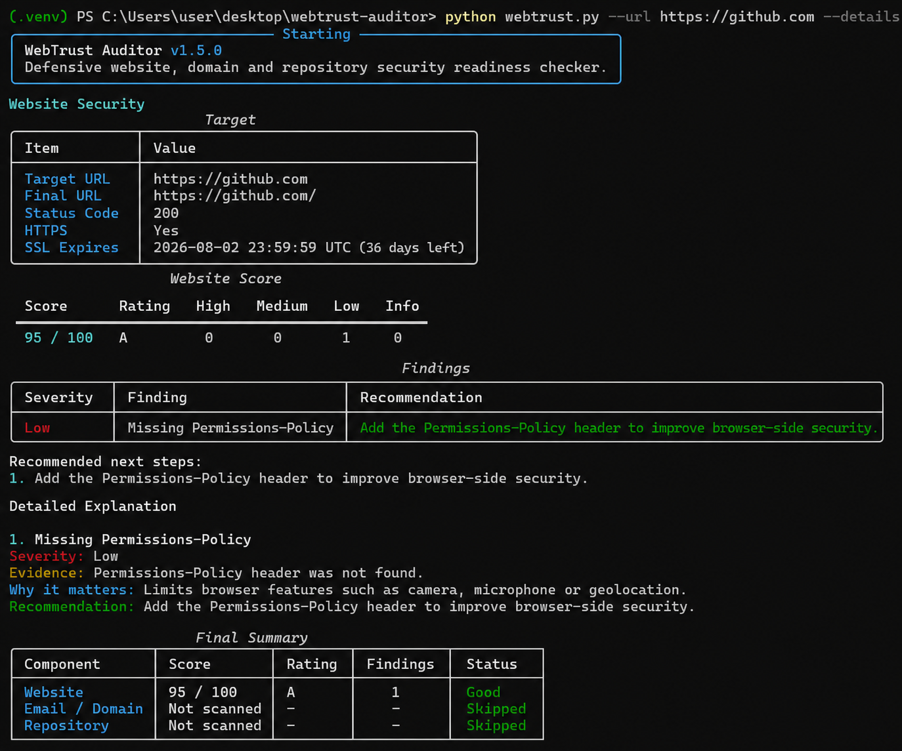
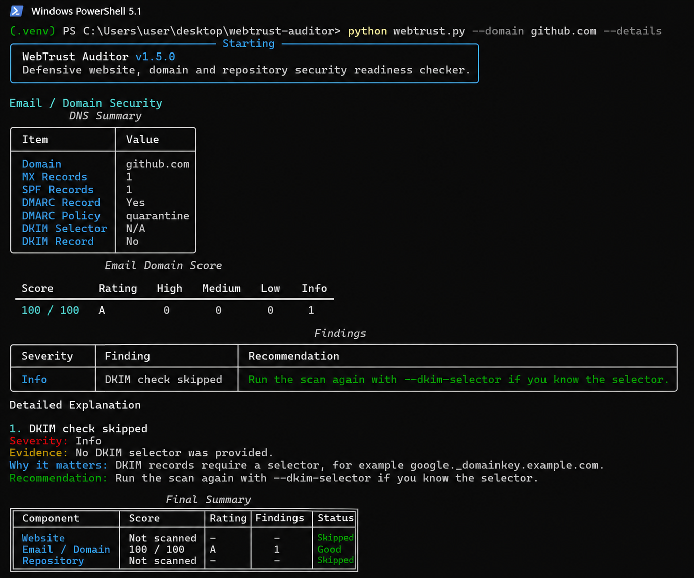
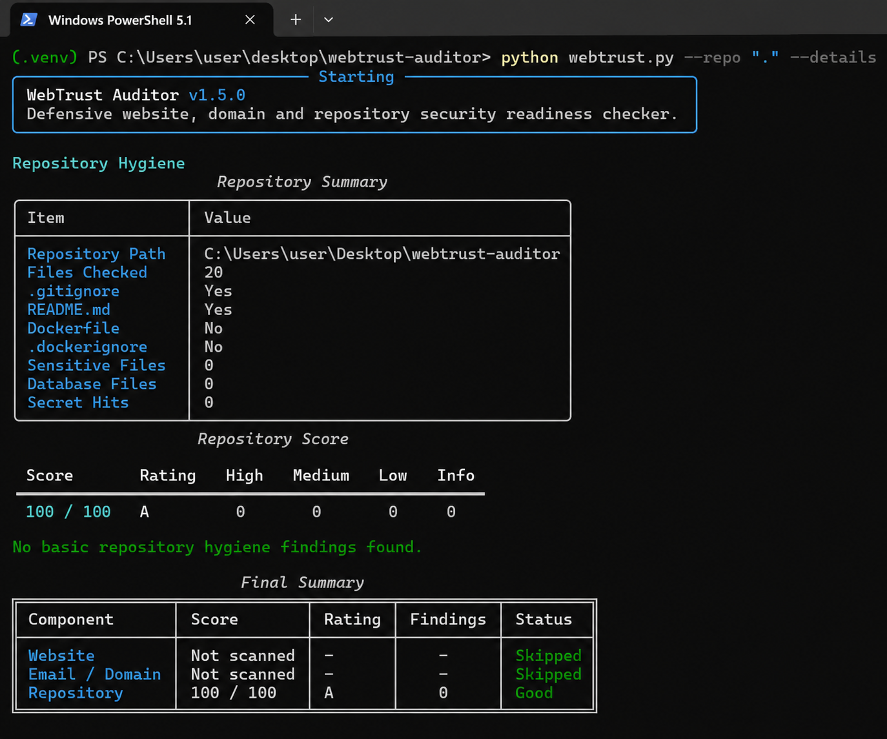
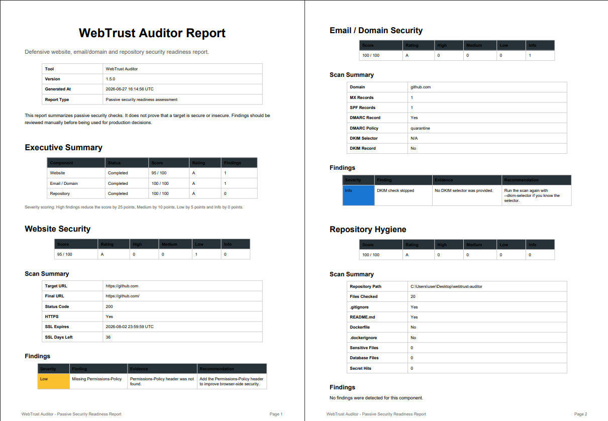

# WebTrust Auditor

[](https://github.com/muvahhhid/webtrust-auditor/actions/workflows/tests.yml)

WebTrust Auditor is a defensive security readiness checker for websites, email domains and local project repositories.

It performs passive checks only. The tool does not exploit, attack, brute-force, bypass authentication, upload files or modify targets. It only reads public HTTP/DNS data and local repository files to generate security findings and reports.

---

## Overview

WebTrust Auditor helps quickly identify common security hygiene issues in:

* websites,
* email/domain configuration,
* local project repositories.

It provides readable terminal output, security scoring, detailed findings, recommendations and optional Markdown, JSON and PDF reports.

---

## Screenshots

### Website Security Scan



### Email / Domain Security Scan



### Repository Hygiene Scan



### PDF Report



---

## Features

### Website Security Checks

WebTrust Auditor checks:

* HTTPS usage
* final URL after redirects
* HTTP status code
* case-insensitive security headers
* SSL certificate expiry date
* software version disclosure in response headers

Checked security headers:

* `Content-Security-Policy`
* `Strict-Transport-Security`
* `X-Frame-Options`
* `X-Content-Type-Options`
* `Referrer-Policy`
* `Permissions-Policy`

The tool also checks whether response headers expose exact software versions, for example:

* `Server: Apache/2.4.49`
* `X-Powered-By: PHP/8.3.4`
* `X-AspNet-Version: 4.0.30319`

Exposing exact version information may help attackers search for known vulnerabilities affecting that specific technology version.

---

### Email / Domain Security Checks

WebTrust Auditor checks:

* MX records
* SPF records
* DMARC records
* DMARC policy
* optional DKIM selector

Example DKIM usage:

```bash
python webtrust.py --domain example.com --dkim-selector google
```

If no DKIM selector is provided, the DKIM check is skipped and reported as informational.

---

### Repository Hygiene Checks

WebTrust Auditor checks local repositories for common public repository risks.

It checks for:

* missing `.gitignore`
* missing `README.md`
* missing `.dockerignore` when a `Dockerfile` exists
* sensitive file names
* sensitive file extensions
* hardcoded secret-like assignments
* advanced secret patterns

Detected sensitive files and extensions include:

* `.env`
* `.env.local`
* `.env.production`
* `secrets.json`
* `id_rsa`
* `id_dsa`
* `.db`
* `.sqlite`
* `.sqlite3`
* `.bak`
* `.pem`
* `.key`
* `.pfx`

Advanced secret detection includes:

* GitHub personal access tokens
* GitHub fine-grained tokens
* AWS access key IDs
* private key blocks
* JWT-like tokens

Example detected patterns:

```text
ghp_...
github_pat_...
AKIA...
-----BEGIN [PRIVATE KEY]-----
eyJ... . ... . ...
```

---

## Report Outputs

WebTrust Auditor supports multiple output formats.

### Terminal Output

The main output is shown directly in the terminal and is designed to be readable in PowerShell, Windows Terminal, macOS Terminal or Linux shells.

### Markdown Report

```bash
python webtrust.py --url https://github.com --domain github.com --repo "." --output reports/github-final-full-report.md
```

Markdown reports are useful for GitHub documentation, notes and lightweight security reports.

### JSON Report

```bash
python webtrust.py --url https://github.com --domain github.com --repo "." --json-output reports/result.json
```

JSON reports are useful for automation, CI/CD pipelines, dashboards and integration with other tools.

### PDF Report

```bash
python webtrust.py --url https://github.com --domain github.com --repo "." --pdf-output reports/webtrust-report.pdf
```

PDF reports are useful for sharing results with non-technical users, clients, managers or as an attachment to a security review.

---

## Security Scoring

Each component receives a score from 0 to 100.

Severity penalties:

| Severity | Penalty |
| -------- | ------: |
| High     |     -25 |
| Medium   |     -10 |
| Low      |      -5 |
| Info     |       0 |

Ratings:

|  Score | Rating |
| -----: | ------ |
| 90-100 | A      |
|  75-89 | B      |
|  60-74 | C      |
|  40-59 | D      |
|   0-39 | F      |

---

## Requirements

* Python 3.10 or newer
* pip

---

## Installation

Clone the repository:

```bash
git clone https://github.com/muvahhhid/webtrust-auditor.git
cd webtrust-auditor
```

Create a virtual environment:

```bash
python -m venv .venv
```

Activate the virtual environment on Windows:

```powershell
.\.venv\Scripts\Activate.ps1
```

Activate the virtual environment on macOS/Linux:

```bash
source .venv/bin/activate
```

Install dependencies:

```bash
pip install -r requirements.txt
```

---

## Usage

Check a website:

```bash
python webtrust.py --url https://github.com
```

Check an email/domain configuration:

```bash
python webtrust.py --domain github.com
```

Check a local repository:

```bash
python webtrust.py --repo "."
```

Run a full scan:

```bash
python webtrust.py --url https://github.com --domain github.com --repo "."
```

Show detailed explanations:

```bash
python webtrust.py --url https://github.com --details
```

Generate Markdown, JSON and PDF reports at the same time:

```bash
python webtrust.py --url https://github.com --domain github.com --repo "." --output reports/github-final-full-report.md --json-output reports/result.json --pdf-output reports/webtrust-report.pdf
```

Show the installed version:

```bash
python webtrust.py --version
```

---

## Example Result

Example command:

```bash
python webtrust.py --url https://github.com --domain github.com --repo "." --output reports/github-final-full-report.md --pdf-output reports/webtrust-report.pdf
```

Example score summary:

| Component               |     Score | Rating |
| ----------------------- | --------: | ------ |
| Website Security        |  95 / 100 | A      |
| Email / Domain Security | 100 / 100 | A      |
| Repository Hygiene      | 100 / 100 | A      |

---

## Running Tests

This project uses `pytest`.

Run tests locally:

```bash
python -m pytest
```

Example result:

```text
12 passed
```

---

## GitHub Actions

This repository uses GitHub Actions to automatically run tests on every push and pull request to the `main` branch.

Workflow file:

```text
.github/workflows/tests.yml
```

The workflow installs dependencies and runs:

```bash
python -m pytest
```

A passing workflow confirms that the main checks and helper functions are working as expected.

---

## Project Structure

```text
webtrust-auditor/
├── .github/
│   └── workflows/
│       └── tests.yml
├── assets/
│   ├── website-scan.png
│   ├── email-domain-scan.png
│   ├── repository-scan.png
│   └── pdf-report.png
├── reports/
│   └── github-final-full-report.md
├── tests/
│   ├── test_repo_scanner.py
│   ├── test_scoring.py
│   └── test_website_scanner.py
├── webtrust_auditor/
│   ├── __init__.py
│   ├── cli.py
│   ├── email_scanner.py
│   ├── pdf_generator.py
│   ├── report_generator.py
│   ├── repo_scanner.py
│   ├── scoring.py
│   └── website_scanner.py
├── .gitignore
├── README.md
├── requirements.txt
└── webtrust.py
```

---

## Safety Notice

WebTrust Auditor is a defensive and passive security tool.

It does not:

* exploit vulnerabilities,
* brute-force logins,
* bypass authentication,
* send malicious payloads,
* modify remote systems,
* upload files,
* perform destructive actions.

Website checks are based on normal HTTP requests and response headers.

Email/domain checks are based on public DNS records.

Repository checks are based on local file names and selected local text files.

Use this tool only for defensive security review, learning and authorized assessments.

---

## Skills Demonstrated

This project demonstrates:

* Python CLI development
* defensive cybersecurity automation
* HTTP security header analysis
* SSL certificate inspection
* DNS email security checks
* SPF, DMARC and DKIM awareness
* local repository hygiene scanning
* secret pattern detection
* risk scoring and classification
* Markdown report generation
* JSON report generation
* PDF report generation
* Rich terminal output
* pytest-based testing
* GitHub Actions CI workflow
* Git and GitHub project publishing

---

## Author

Created by [muvahhhid](https://github.com/muvahhhid)

---

## License

This project is intended for educational and defensive security purposes.
